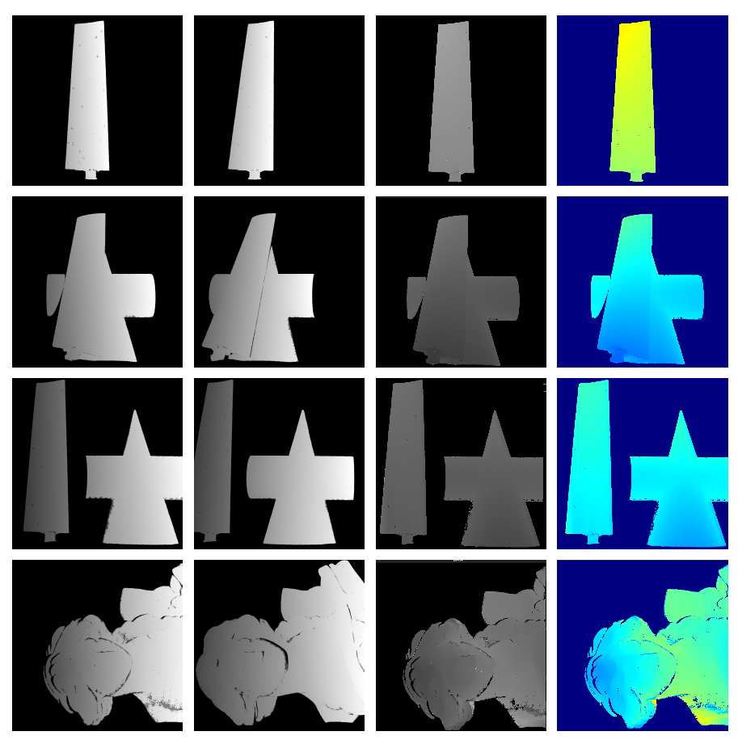

# steroMatch(基于Block Match的立体匹配)
本项目是传统基于Block Match的局部立体匹配算法应用到结构光三维重建中的C++实现。
目前实现了如下匹配代价:
- SAD(Sum of Absolute Differences)  completed
- SSD(Sum of Squared Differences)   TODO
- census变换                        TODO
- Zero-mean                         TODO
- Locally scaled                     TODO
- NCC(Normalized Cross COrrelation)   TODO

目前，结构光三维重建使用的是面结构光中的条纹轮廓测量技术，其通过投影仪向待测物体投射若干张正弦条纹图像，由
左右两个相机进行拍照。经过包裹相位算法及解包裹算法得到绝对相位图。然后采用本项目中的立体匹配方法得到视差图，
再带入双目相机模型中计算得到点云信息。

绝对相位图本身的相位就提供了很好的匹配依据，这使得仅仅使用Block Match来匹配获得的视差图效果就比较好。至于是否需要
代价聚合、视差优化等步骤仍然需要进行讨论。

**本项目输入和输出：**
- 输入：经过立体矫正之后的左右绝对相位图
- 输出：两幅视差图
## 结果展示

## 环境
## 第三方库
## 算法引导
## 优缺点